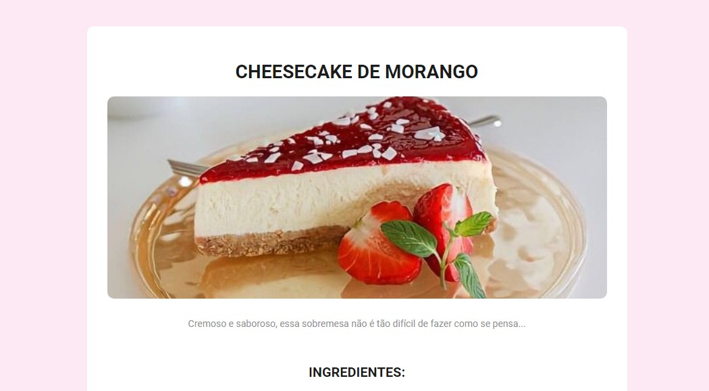

<h1 align="center">Cheesecake Receita</h1>

Projeto desafio da Rocketseat - Página de Receita.  

  <a href="#-tecnologias">Tecnologias</a>&nbsp;&nbsp;&nbsp;|&nbsp;&nbsp;&nbsp;
  <a href="#-projeto">Projeto</a>&nbsp;&nbsp;&nbsp;|&nbsp;&nbsp;&nbsp;
  <a href="#memo-licença">Licença</a>

  

 

  

## 🚀 Tecnologias

Esse projeto foi desenvolvido com as seguintes tecnologias:

- HTML
- CSS
- Git e Github

## 💻 Projeto

Criar uma página de receita real.

## :memo: Licença

Esse projeto está sob a licença MIT.

---

Com ♥ Sabrina
